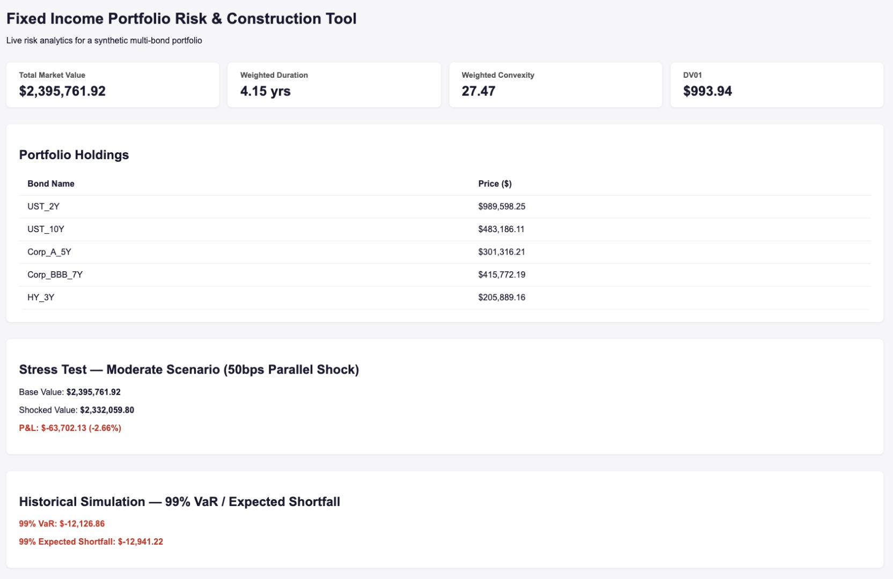
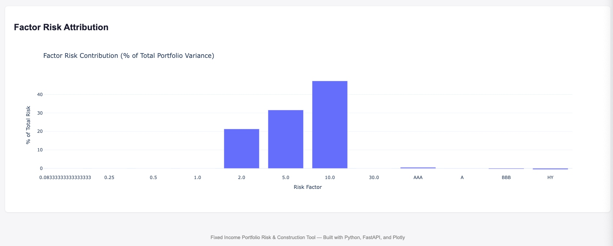

# Fixed Income Portfolio Risk & Construction Tool

A from-scratch Python implementation of fixed income analytics, portfolio risk
decomposition, stress testing, VaR/Expected Shortfall, and MSCI Barra-style
factor attribution — built as a portfolio project for Portfolio Construction &
Risk Analyst roles in asset management (e.g., Fidelity International).

Live dashboard built with FastAPI + Plotly, integrating every risk metric into
a single interactive view.

---

## Table of Contents
- [Project Overview](#project-overview)
- [Demo](#demo)
- [Architecture](#architecture)
- [Setup Instructions](#setup-instructions)
- [Phase-by-Phase Summary](#phase-by-phase-summary)
- [Key Results](#key-results)
- [Known Limitations](#known-limitations)
- [Future Work](#future-work)
- [Tech Stack](#tech-stack)

---

## Project Overview

This project builds a complete fixed income risk analytics pipeline from first
principles — no third-party bond pricing or risk libraries — to demonstrate a
deep, ground-up understanding of the math and mechanics behind institutional
risk systems. The project is organized into five phases, each with its own
validated unit tests and a documented set of interview-style checkpoint
questions used to confirm conceptual understanding before proceeding.

**Portfolio used throughout:** a synthetic 5-bond portfolio (~$2.4M total
market value) spanning AAA Treasuries, A/BBB corporates, and one high-yield
bond, with maturities from 2 to 10 years.

---

## Demo

**Dashboard — Portfolio Summary, Holdings, Stress Test & VaR:**



**Dashboard — Factor Risk Attribution Chart:**



The dashboard runs locally via FastAPI, pulling live Treasury and credit
spread data from FRED at startup and rendering all risk metrics through a
single Jinja2 + Plotly interface.

---

## Architecture

```
fixed-income-risk-tool/
├── app/
│   ├── main.py              # FastAPI app and dashboard route
│   ├── templates/
│   │   └── dashboard.html   # Jinja2 dashboard template
│   └── static/
│       └── style.css
├── src/
│   ├── bond.py               # Phase 1: bond pricing, YTM, duration, convexity
│   ├── data_loader.py        # FRED + yfinance data sourcing
│   ├── portfolio.py          # Phase 2: portfolio aggregation & risk decomposition
│   ├── stress_test.py        # Phase 3: scenario/stress testing
│   ├── var_es.py             # Phase 4: Historical Simulation & Monte Carlo VaR/ES
│   └── factor_attribution.py # Phase 5: factor risk attribution
├── tests/                     # pytest unit tests for Phases 1-3
├── notebooks/                 # exploratory notebooks per phase
├── docs/                       # dashboard screenshots for README
├── requirements.txt
└── README.md
```

---

## Setup Instructions

**1. Clone and set up a virtual environment (macOS):**
```bash
git clone <your-repo-url>
cd fixed-income-risk-tool
python3 -m venv .venv
source .venv/bin/activate
pip install -r requirements.txt
```

**2. Get a free FRED API key** at [fred.stlouisfed.org](https://fred.stlouisfed.org),
then create a `.env` file in the project root:
```
FRED_API_KEY=your_key_here
```

**3. Run the test suite:**
```bash
pytest tests/ -v
```

**4. Launch the dashboard:**
```bash
uvicorn app.main:app --reload
```
Then open `http://127.0.0.1:8000` in your browser.

---

## Phase-by-Phase Summary

### Phase 1 — Bond Math Foundations
Built a `Bond` class from first principles: price, cash-flow schedule, a
Newton-Raphson YTM solver, Macaulay/modified duration, and convexity. Validated
against textbook identities (par-bond pricing, zero-coupon duration equals
maturity).

### Phase 2 — Portfolio Aggregation & Risk Decomposition
Built a `Portfolio` class aggregating multiple bonds into market-value-weighted
duration, convexity, and DV01. Attempted single-bond rate-vs-spread risk
decomposition — see [Known Limitations](#known-limitations).

### Phase 3 — Stress Testing & Scenario Analysis
Implemented parallel rate shocks, curve steepening/flattening twists, and
credit spread widening scenarios, all validated by comparing full repricing
against duration + convexity approximations — confirming convexity's growing
importance at larger shock sizes.

### Phase 4 — VaR / Expected Shortfall
Implemented both Historical Simulation and Monte Carlo VaR/ES. Adding an
empirical rate-spread correlation matrix to the Monte Carlo simulation
converged its 99% VaR estimate to within ~1% of the Historical Simulation
figure, cross-validating both methodologies.

### Phase 5 — Factor Attribution & Dashboard
Built an MSCI Barra-style factor risk attribution model decomposing total
portfolio variance across yield curve and credit spread factors, and shipped
a FastAPI + Plotly dashboard integrating all four prior phases into one live
view.

---

## Key Results

| Metric | Value |
|---|---|
| Portfolio market value | $2,395,761.92 |
| Weighted modified duration | 4.15 years |
| Weighted convexity | 27.47 |
| DV01 | $993.94 per bp |
| Moderate stress scenario (50bps parallel shock) P&L | -$63,702.13 (-2.66%) |
| Severe stress scenario (100bps + credit widening) P&L | -$117,220 |
| 99% Historical Simulation VaR | -$12,126.86 |
| 99% Historical Simulation Expected Shortfall | -$12,941.22 |
| 99% Monte Carlo VaR (correlated) | -$12,072.87 |
| Dominant risk factor (factor attribution) | 10Y rate point (~47% of variance) |

---

## Known Limitations

**Rate/spread decomposition under a single-factor yield model (Phase 2):**
The `Bond` pricing engine accepts a single flat YTM, where
`effective_yield = risk_free_rate + credit_spread`. Because both components
combine additively into one scalar before pricing, bumping either component
by 1bp produces an identical price change — `rate_dv01` and `spread_dv01`
computed this way are mathematically guaranteed to be equal at the single-bond
level, and do not represent a true economic decomposition. This project
instead uses volatility-weighted risk contribution as a practical proxy, and
resolves true rate/spread separation at the *portfolio* level in Phase 5 via
factor covariance decomposition.

**Factor attribution and correlated risk offsets (Phase 5):**
Portfolio-level factor risk contributions can be negative for a given factor
when that factor is negatively correlated with a dominant factor (here, credit
spreads showed near-zero or negative contribution due to their negative
correlation with the portfolio's larger rate risk). This reflects each
factor's *marginal* contribution to total portfolio variance, not the
*standalone* risk of holding that exposure in isolation, and should be read
alongside standalone risk measures rather than in isolation.

**Synthetic portfolio and index-level credit spreads:**
Individual bond-level pricing/spread data (e.g., TRACE) is not freely
available; this project uses rating-bucket-level OAS spreads (FRED) as a
proxy, which will lag real-time, name-specific credit deterioration (rating
migration lag).

---

## Future Work

- Extend `Bond` pricing to accept independent risk-free and credit spread
  discount curves per cash flow, enabling genuine (non-duplicated) rate vs.
  spread DV01 decomposition at the single-bond level.
- Add key rate duration reporting directly into the dashboard.
- Vectorize Monte Carlo repricing to remove the current per-simulation Python
  loop bottleneck.
- Add time-series views of factor risk contribution for CIO-level quarterly
  reporting, versus the current single-snapshot view.

---

## Tech Stack

Python · pandas · NumPy · SciPy · Plotly · FastAPI · Jinja2 · pytest ·
FRED API · yfinance

---

## Author

Ken Wong — Graduate student in risk management science at CUHK. 
Built as a self-directed portfolio project for asset management
and portfolio risk analyst roles.
